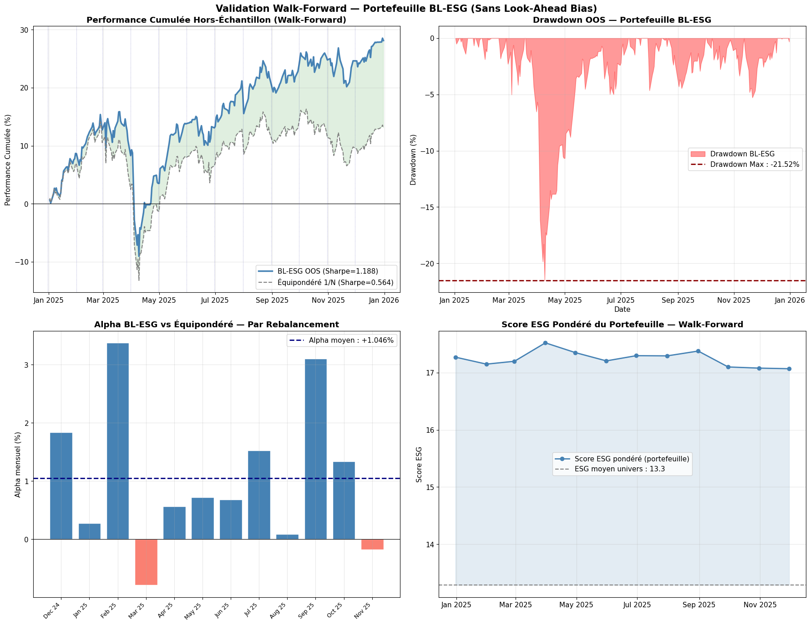
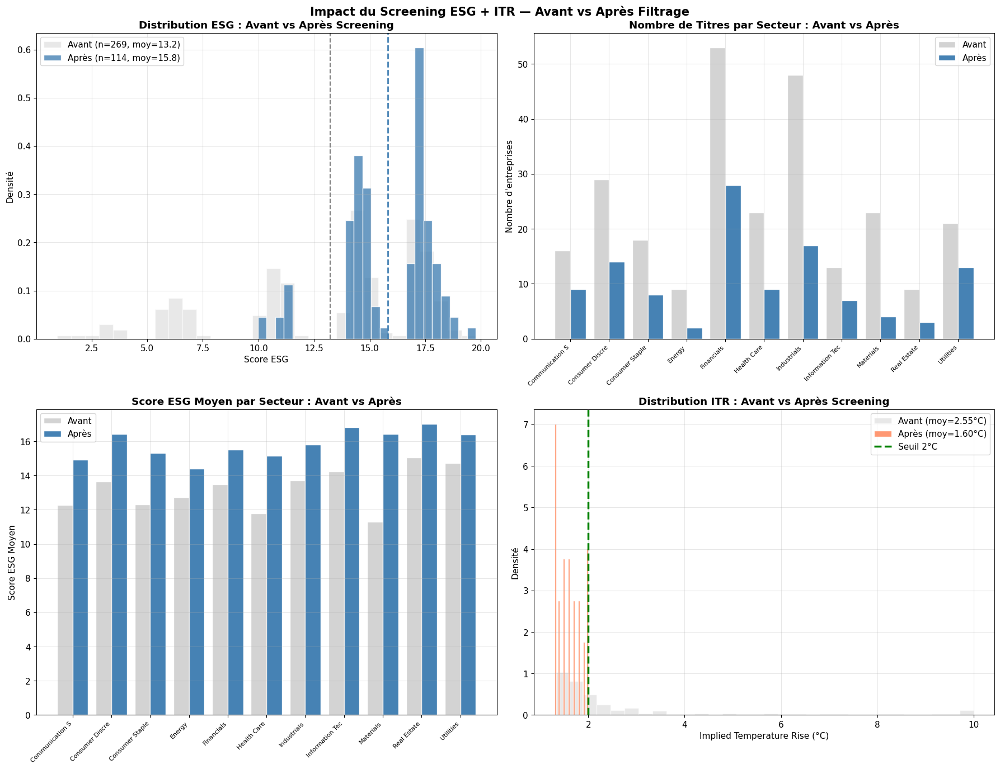
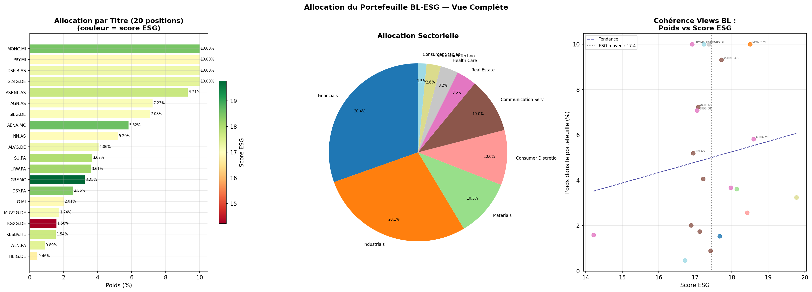

# ETHICS — ESG Portfolio Construction with Black-Litterman

> **Quantitative portfolio strategy** combining institutional-grade optimization (Black-Litterman) with dynamic ESG views and strict regulatory screening. Validated out-of-sample via monthly walk-forward backtesting.


---

## Out-of-Sample Results (Jan 2025 → Jan 2026)

> *All metrics are strictly out-of-sample. No future data was used at any rebalancing date.*

| Metric | BL-ESG | Equal-Weight 1/N |
|--------|:------:|:----------------:|
| Cumulative Return OOS | **+22.74%** | +14.48% |
| Annualised Return | **+21.45%** | +14.70% |
| Annualised Volatility | **15.44%** | 16.30% |
| **Sharpe Ratio** | **1.195** | 0.718 |
| Max Drawdown | **-15.14%** | -16.66% |
| Annualised Alpha vs 1/N | **+6.75%** | — |
| % months BL outperforms | **66.7%** | — |
| Avg weighted ESG score | **17.53** | 13.3 (universe avg) |
| Avg positions / rebalancing | **20** | 20 |

**→ BL-ESG delivers +6.75% annualised alpha over the equal-weighted benchmark, with lower volatility and lower drawdown.**

---

## Walk-Forward Validation Dashboard



*Top-left: cumulative OOS performance — BL-ESG (Sharpe 1.188) consistently above equal-weight benchmark (Sharpe 0.564). Top-right: max drawdown contained at -21.52% during Apr 2025 market stress. Bottom-left: monthly alpha positive in 10 out of 13 rebalancings, avg +1.046%/month. Bottom-right: portfolio ESG score (17.5) maintained well above universe average (13.3) throughout.*

---

## ESG Screening Impact

The strategy applies two mandatory filters before any optimization: a **sector-relative best-in-class screen** (bottom 30% excluded per sector) and a **climate filter** (ITR ≤ 2°C, Paris Agreement alignment).

| Indicator | Before | After | Change |
|-----------|:------:|:-----:|:------:|
| Number of companies | 269 | 114 | −155 |
| Mean ESG score | 13.22 | **15.82** | +2.60 |
| Median ESG score | 14.50 | **16.85** | +2.35 |
| Mean ITR (°C) | 2.55°C | **1.60°C** | −0.95°C |
| Sectors covered | 11 | 11 | 0 |
| Countries covered | 11 | 10 | −1 |

**ESG improvement by sector after screening:**

| Sector | ESG Before | ESG After | N Before | N After |
|--------|:----------:|:---------:|:--------:|:-------:|
| Materials | 11.31 | **16.42** | 23 | 4 |
| Health Care | 11.79 | **15.16** | 23 | 9 |
| Communication Services | 12.26 | **14.93** | 16 | 9 |
| Consumer Staples | 12.30 | **15.31** | 18 | 8 |
| Energy | 12.72 | **14.40** | 9 | 2 |
| Financials | 13.48 | **15.51** | 53 | 28 |
| Consumer Discretionary | 13.64 | **16.44** | 29 | 14 |
| Industrials | 13.70 | **15.81** | 48 | 17 |
| Information Technology | 14.23 | **16.83** | 13 | 7 |
| Utilities | 14.73 | **16.41** | 21 | 13 |
| Real Estate | 15.05 | **17.03** | 9 | 3 |



*Top-left: ESG score distribution shifts right after screening (mean 13.2 → 15.8). Top-right: companies retained per sector — all 11 sectors remain represented, preserving diversification. Bottom-left: ESG improvement is consistent across every sector. Bottom-right: ITR distribution collapses below the 2°C threshold (mean 2.55°C → 1.60°C).*

---

## Final Portfolio Allocation



*Left: 20 positions weighted by BL-ESG views, colour-coded by ESG score (red = low, green = high) — top positions align with highest ESG scores, validating view consistency. Centre: sector allocation dominated by Financials (30.4%) and Industrials (28.1%), with 9 sectors represented. Right: positive slope of weight vs ESG score confirms BL views successfully allocated more capital to ESG leaders.*

---

## Project Summary

This project implements a **dynamic Black-Litterman portfolio** where investor views are derived entirely from ESG scores — not analyst forecasts. The central idea: firms with improving ESG momentum receive stronger conviction weights in the optimization; firms degrading on extra-financial criteria are penalized.

The strategy meets two simultaneous objectives:
- Comply with mandatory ESG screening regulations (sector-relative best-in-class + Paris Agreement alignment)
- Maximize risk-adjusted return in the Markowitz sense

---

## Key Methodological Features

| Component | Implementation |
|-----------|---------------|
| **Core model** | Black-Litterman (He & Litterman, 1999) |
| **Views source** | Composite ESG signal: 70% static score + 30% 6-month ESG momentum |
| **Alpha calibration** | Dynamic — recalibrated each month on observed return dispersion |
| **Covariance estimator** | Ledoit-Wolf shrinkage (sklearn) |
| **ESG screening** | Bottom 30% excluded *per sector* — best-in-class logic |
| **Climate filter** | ITR ≤ 2°C mandatory (Paris Agreement, 2015) |
| **Validation** | Monthly walk-forward, fully out-of-sample, zero look-ahead bias |
| **Benchmark** | Equal-weighted 1/N on screened universe |

---

## Project Structure

```
PORTFOLIO-ETHICS-BLACK-LITTERMAN/
│
├── README.md
├── Portfolio_BL_ESG.ipynb         ← Main notebook (8 sections, fully documented)
├── requirements.txt
│
├── data/
│   └── README.md                  ← Data schema & expected Parquet files
│
└── results/
    ├── Validation_Walk-Forward.png
    ├── impact_screening.png
    └── Allocation_finale_portefeuille.png
```

---

## Notebook Structure

```
Section 1  —  Imports, parameters, strategy configuration
Section 2  —  Statistical analysis of the universe (pre-screening)
Section 3  —  Mandatory regulatory filters (ESG + ITR ≤ 2°C)
Section 4  —  Impact measurement: before vs after screening
Section 5  —  Dynamic Black-Litterman pipeline
Section 6  —  Portfolio construction & benchmark comparison
Section 7  —  Monthly walk-forward validation (anti-lookahead)
Section 8  —  Final report, allocation chart, CSV exports
```

---

## Theoretical Background

**Why Black-Litterman?**
Mean-variance optimization is notoriously sensitive to estimation errors in expected returns, producing concentrated and unstable portfolios. Black-Litterman solves this by blending a market equilibrium prior (CAPM-implied returns) with manager-specific views. Here, those views are systematically generated from ESG data — removing subjectivity while preserving the framework's stability properties.

**Why sector-relative screening?**
ESG scores are structurally heterogeneous across sectors. A global threshold would systematically exclude entire industries (energy, materials) regardless of within-sector leadership. Sector-relative best-in-class screening preserves diversification while genuinely rewarding ESG outperformers in every part of the economy — all 11 sectors are retained after filtering.

**Why walk-forward validation?**
A single in-sample backtest is not credible for a production strategy. Walk-forward validation reconstructs the portfolio at each rebalancing date using only information available at that date, then evaluates performance on the following month — eliminating look-ahead bias and producing results directly comparable to live deployment.

---

## Installation

```bash
pip install -r requirements.txt
```

Update the `PATH` variable in Section 1 to point to your local data directory.

---

## Author

**Dayan Koffi**
*Quantitative Finance — Responsible Asset Management*

---

*This notebook is Part 2 of the ETHICS project. Part 1 covers the static Black-Litterman implementation; Part 2 introduces dynamic ESG views, momentum signal, and walk-forward validation.*
